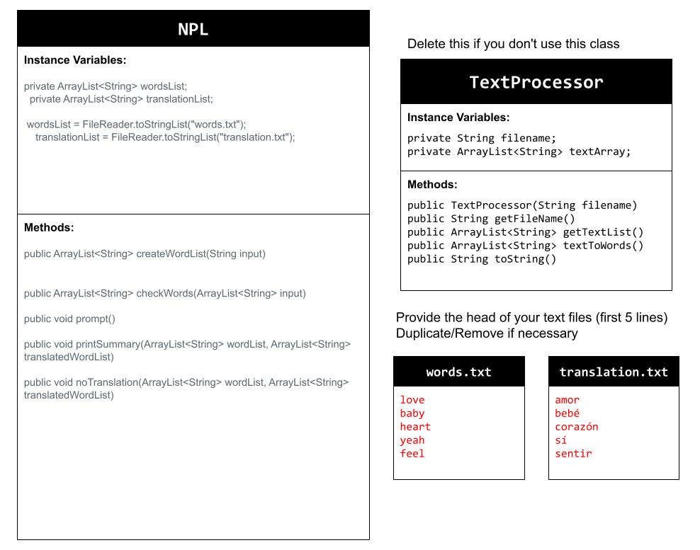

# Unit 6 - Natural Language Processing Project

## Introduction

Natural language processing (NLP) is used in many apps and devices to interact with users and make meaning of text to determine how to respond, find information, or to create new text. Your goal is to use natural language processing techniques to identify structure, patterns, and meaning in a text to have conversations with a user, execute commands, perform manipulations on the text, or generate new text.

## Requirements

Use your knowledge of object-oriented programming, ArrayLists, the String class, and algorithms to create a program that uses natural language processing techniques:

- **Create at least two ArrayLists** – Create at least two ArrayLists to store the data used in your program, such as data from text files or entered by the user.
- **Implement one or more algorithms** – Implement one or more algorithms that use loops and conditionals to find or manipulate elements in an ArrayList or String object.
- **Use methods in the String classs** - Use one or more methods in the String class in your program, such as to divide text into sentences or phrases.
- **Use at least one natural language processing technique** – Use a natural language processing technique to process, analyze, and/or generate text.
- **Document your code** – Use comments to explain the purpose of the methods and code segments and note any preconditions and postconditions.

## UML Diagram

## Video
Link to Youtube Video:
https://youtu.be/iJlWK9rM5mI

Thumbnail:

## Project Description

If there is a situation where you really want to tell your friend who only speaks Spanish the name of a song you love, use our Song Title Translator! Song Title Translator gets the user input (title of any song in English) and translates it into Spanish and returns it. For example, if the user input was "love", our app analyzes that input, searches through the Original list, and finds the word in the translation word list at the same index, and returns it, so "love" would return as "amor". 
## NLP Techniques

Write a description of what natural lanugage technique (NLP) you implemented in your project. State which methods in your project are associated with this, and a brief explanation of how those methods work and how they are necessary in the NLP technique. 